# Real-Time Join & Forecasting with Confluent Cloud

**Use case:** picture an online trading platform. Stock trades are streaming in constantly, and the team wants two things live: who's trading and where they're from (a **join**), and which stocks are surging in activity so they can spot momentum as it builds (a **forecast**). In this lab you'll build exactly that — entirely inside Confluent Cloud, no Terraform, no local setup. Total time: ~45–50 minutes, including sign-up.

---

## 1. Sign Up

1. Go to `confluent.cloud/signup` and create an account with your email.
   
2. Verify your email and log in to the Confluent Cloud console.
   

---

## 2. Create a Cluster

1. On the **Environments** page, open the `default` environment that came with your account.
   
2. On the **Create cluster** page, keep the default configuration — **Standard** cluster, **AWS**, region **us-east-2** — and click **Continue**.
   
   
3. On the **Enter payment information** screen, add your card details — you won't be charged until your free trial ends — then click **Submit**.
   
   

> [!TIP]
> **You won't be charged.** Every new Confluent Cloud signup includes **$400 in free credit**, which more than covers this workshop. A card is only required to activate your account.

4. Back on the **Create cluster** page, click **Launch cluster** — it shows **Running** once ready.
   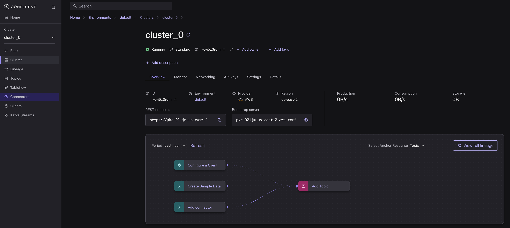

---

## 3. Generate Data Sources

1. From your cluster, open **Connectors** and click **Add Connector**.
   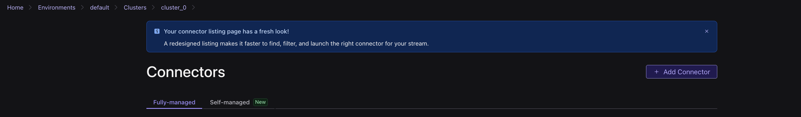
2. Choose the **Sample Data** (Datagen Source) connector and click **Get started**.
   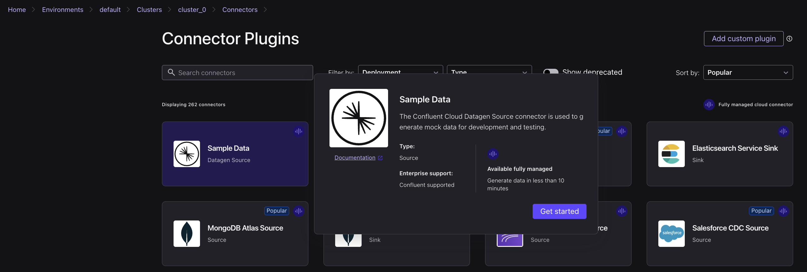
3. Select the **Users** template — it writes to the `sample_data_users` topic — then click **Launch**.
   
4. Add another connector the same way, select the **Stock trades** template — it writes to `sample_data_stock_trades` — then click **Launch**.
   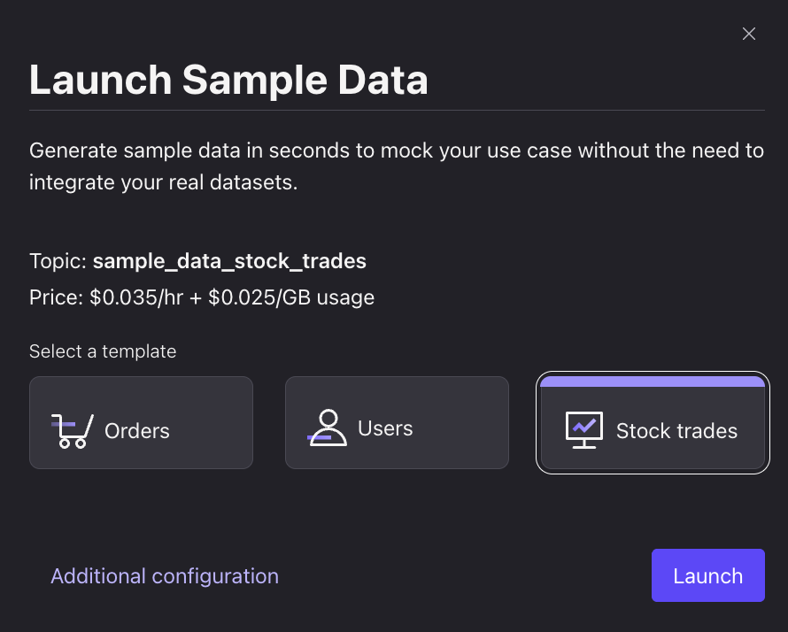
5. Wait until both connectors show **Running**.
   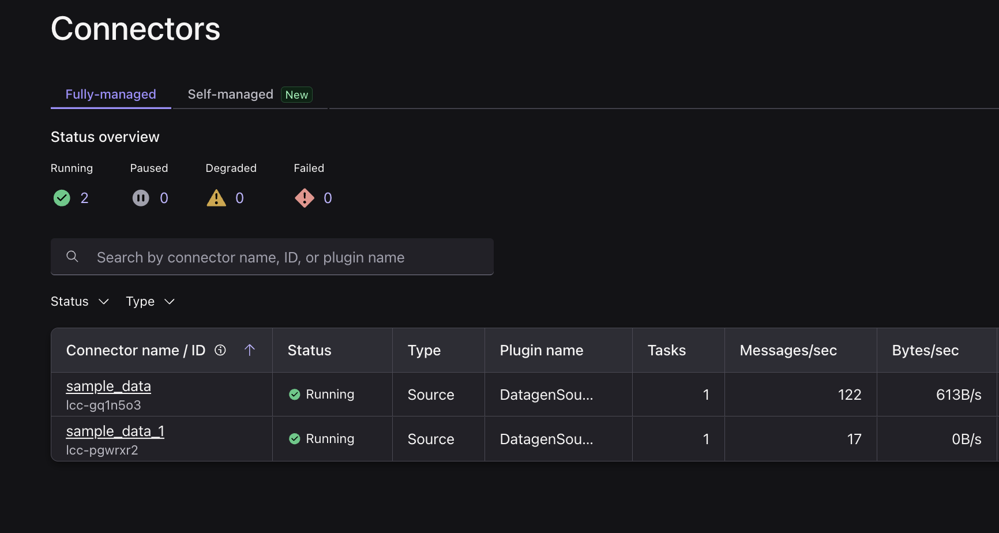
6. From the left nav, open **Topics**.

   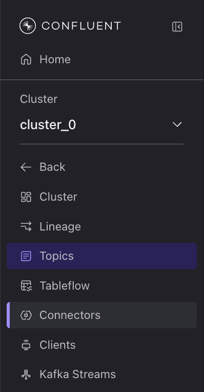
7. Click **sample_data_users**, then open the **Messages** tab to view live user records.
   
8. Click **sample_data_stock_trades**, open the **Messages** tab, and note the shared `userid` field.
   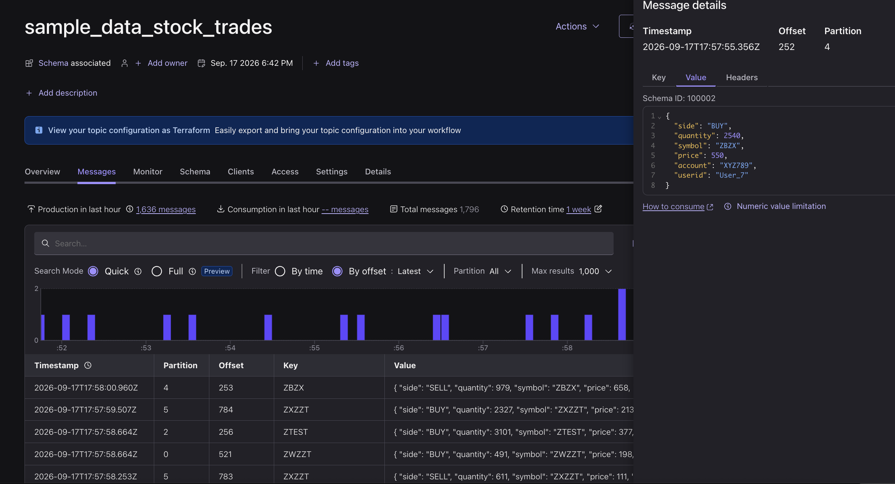

---

## Lab 2: Enrich & Forecast Live Trades with Flink

With trades and customer data now streaming, use Flink SQL to answer the two business questions from the use case: **who is trading and from where** (enrichment), and **which stocks are heating up** (forecast) — both computed continuously on the live streams.

### Step 1: Enrich Live Trades with Customer Context

1. [Open Flink](https://confluent.cloud/go/flink), select the **default** environment, and click **Continue**.

   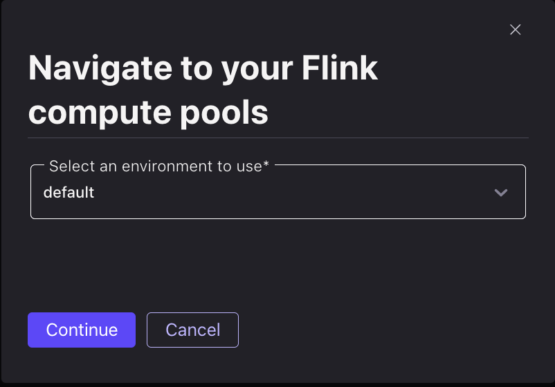
2. On the **Compute pools** tab, click **SQL Workspace** on the default pool (created for you automatically).
   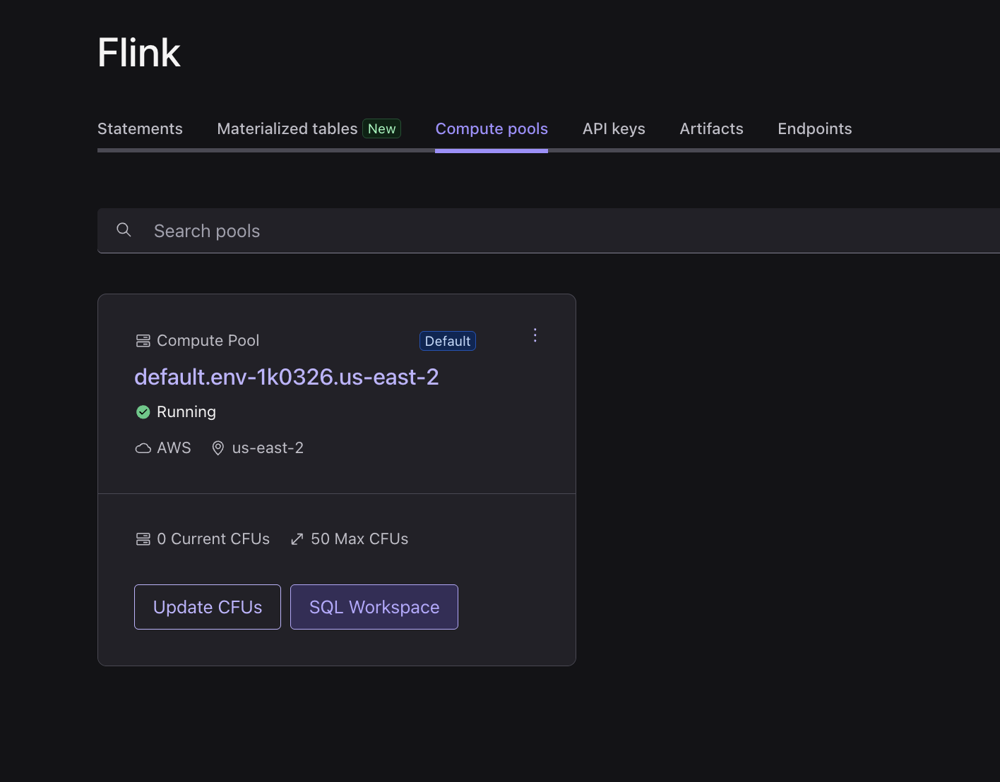
3. In the workspace, set **Use catalog** to `default` and **Use database** to `cluster_0` so your topics resolve as tables.
   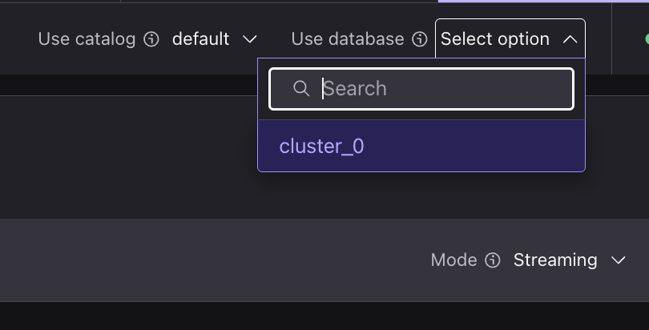
4. `sample_data_users` from Datagen is an append-only stream, so first key it into a lookup table that keeps the latest row per user using a [materialized table](https://docs.confluent.io/cloud/current/flink/reference/statements/create-materialized-table.html):

   ```sql
   CREATE MATERIALIZED TABLE users_keyed (
     userid STRING NOT NULL,
     regionid STRING,
     gender STRING,
     PRIMARY KEY (userid) NOT ENFORCED
   ) AS
   SELECT COALESCE(userid, '') AS userid, regionid, gender FROM sample_data_users;
   ```

> [!TIP]
> A **materialized table** bundles a table and its continuous query into one object — define it once, with no separate `INSERT INTO` to manage. Better yet, you can evolve its logic in place with `CREATE OR ALTER MATERIALIZED TABLE` (change the query, add columns) instead of tearing statements down and rebuilding them.

5. Enrich each trade with its user's region and gender using a temporal join, and store the result to a `trades_enriched` topic that the next lab will forecast on:

   ```sql
   CREATE MATERIALIZED TABLE trades_enriched AS
   SELECT
     t.userid,
     t.symbol,
     t.side,
     t.quantity,
     t.price,
     u.regionid,
     u.gender
   FROM sample_data_stock_trades t
   JOIN users_keyed FOR SYSTEM_TIME AS OF t.`$rowtime` AS u
     ON t.userid = u.userid;
   ```

6. Query the enriched stream to confirm each trade now carries its customer's region and gender:

   ```sql
   SELECT * FROM trades_enriched;
   ```

   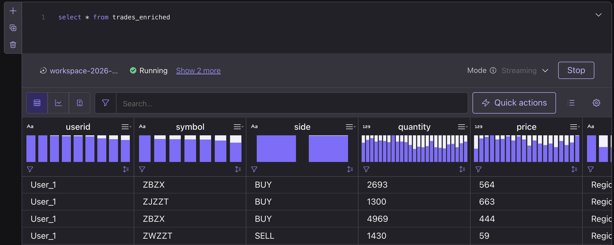

---

### Step 2: Forecast Trades per Stock

`ML_FORECAST` needs a real time series (a numeric value per timestamp), so window `trades_enriched` into a per-stock trade count every 10 seconds and forecast each symbol on its own. The inner query tumbles trades into `trade_count` per `symbol`, and `ML_FORECAST` — partitioned by `symbol` — projects where each stock's activity is heading (`minTrainingSize` is set to 10, applied per symbol, so a forecast appears once a stock has ~10 windows of history).

1. Create the forecast as a materialized table so the projections persist to a topic:

   ```sql
   CREATE MATERIALIZED TABLE trades_forecast AS
   SELECT
     window_start,
     symbol,
     ML_FORECAST(
       CAST(trade_count AS DOUBLE),
       window_start,
       JSON_OBJECT('minTrainingSize' VALUE 10, 'horizon' VALUE 5)
     ) OVER (
       PARTITION BY symbol
       ORDER BY window_time
       RANGE BETWEEN UNBOUNDED PRECEDING AND CURRENT ROW
     ) AS forecast
   FROM (
     SELECT window_start, window_time, symbol, COUNT(*) AS trade_count
     FROM TABLE(
       TUMBLE(TABLE trades_enriched, DESCRIPTOR($rowtime), INTERVAL '10' SECONDS)
     )
     GROUP BY window_start, window_end, window_time, symbol
   );
   ```

2. Inspect the output to see the forecasted trade count for each stock:

   ```sql
   SELECT * FROM trades_forecast;
   ```

   
