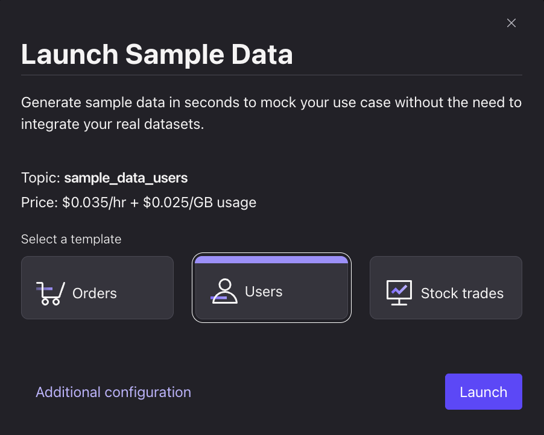
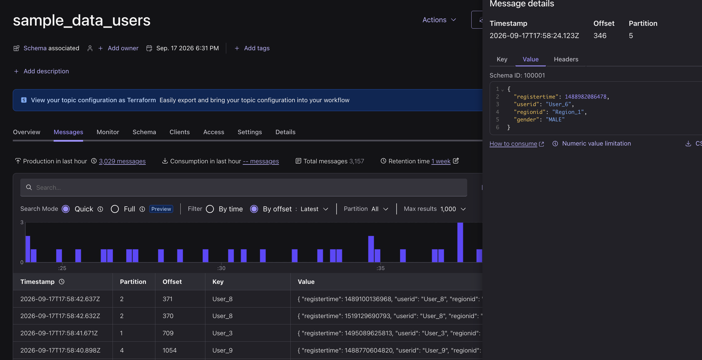
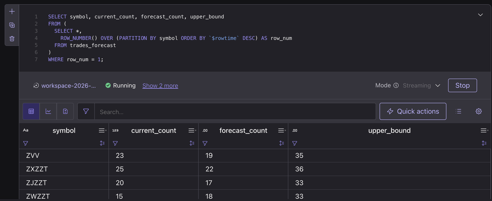

# Real-Time Join & Forecasting with Confluent Cloud

**Use case:** picture a retail website during a flash sale. Pageviews are streaming in constantly, and the team watching it wants two things live: who's browsing and where they're from (a **join**), and a heads-up before traffic spikes so they can scale up before the site slows down (a **forecast**). In this lab you'll build exactly that — entirely inside Confluent Cloud, no Terraform, no local setup. Total time: ~45–50 minutes, including sign-up.

---

## 1. Sign Up

1. Go to `confluent.cloud/signup` and create an account with your email.
   
2. Verify your email and log in to the Confluent Cloud console.
   

---

## 2. Create a Cluster

1. Click **Create cluster**, choose the **Basic** cluster type.
   
2. Select cloud provider **AWS** and region **us-east-1**, then launch it.
   

---

## 3. Create the Datagen Connectors

1. In your cluster, go to **Connectors → Datagen Source**, and create one using the **Users** quickstart template.
   
2. Create a second Datagen Source connector using the **Pageviews** quickstart template.
   

Both templates generate a `userid` in the same `User_1`–`User_9` range — that's what makes them joinable in the next lab.

---

## 4. Explore the Data

1. Open **Topics → users** and view live messages.
   
2. Open **Topics → pageviews** and view live messages — note the shared `userid` field.
   

---

## Lab 2 — Step 1: Flink Join

1. Open **Flink → SQL Workspace** (create a compute pool if prompted).
   
2. Run this query to enrich each pageview with the user's region and gender:

   ```sql
   SELECT
     p.userid,
     p.pageid,
     p.viewtime,
     u.regionid,
     u.gender
   FROM pageviews p
   JOIN users u
     ON p.userid = u.userid;
   ```

   

---

## Lab 2 — Step 2: Flink Built-in Forecasting Model

`ML_FORECAST` needs a real time series (a numeric value per timestamp), so first turn raw pageviews into a windowed count:

1. Create a 1-minute tumbling-window view of pageview volume:

   ```sql
   CREATE TABLE pageviews_per_minute AS
   SELECT
     window_start,
     window_end,
     COUNT(*) AS pageview_count
   FROM TABLE(
     TUMBLE(TABLE pageviews, DESCRIPTOR($rowtime), INTERVAL '1' MINUTE)
   )
   GROUP BY window_start, window_end;
   ```

   

2. Run `ML_FORECAST` over that time series to project the next 5 minutes of pageview volume:

   ```sql
   SELECT
     window_start,
     ML_FORECAST(
       CAST(pageview_count AS DOUBLE),
       window_start,
       JSON_OBJECT('horizon' VALUE 5)
     ) OVER (
       ORDER BY window_start
       RANGE BETWEEN UNBOUNDED PRECEDING AND CURRENT ROW
     ) AS forecast
   FROM pageviews_per_minute;
   ```

   
