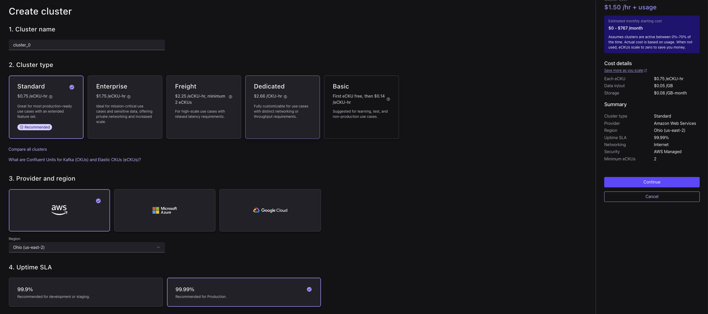
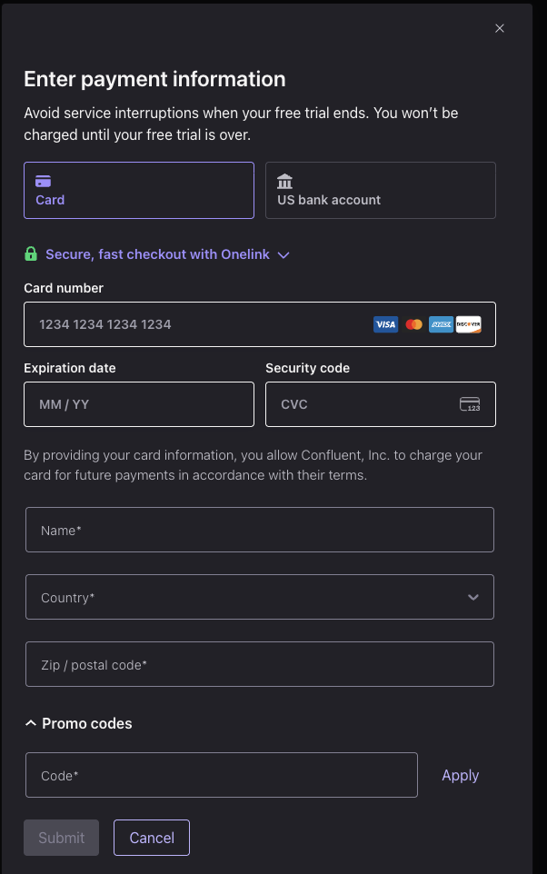

# Real-Time Join & Forecasting with Confluent Cloud

**Use case:** picture a retail website during a flash sale. Pageviews are streaming in constantly, and the team watching it wants two things live: who's browsing and where they're from (a **join**), and a heads-up before traffic spikes so they can scale up before the site slows down (a **forecast**). In this lab you'll build exactly that — entirely inside Confluent Cloud, no Terraform, no local setup. Total time: ~45–50 minutes, including sign-up.

---

## 1. Sign Up

1. Go to `confluent.cloud/signup` and create an account with your email.
   
2. Verify your email and log in to the Confluent Cloud console.
   

---

## 2. Create a Cluster

1. On the **Environments** page, open the `default` environment that came with your account.
   
2. On the **Create cluster** page, keep the default configuration — **Standard** cluster, **AWS**, region **us-east-2** — and click **Continue**.
   
3. On the **Enter payment information** screen, add your card details — you won't be charged until your free trial ends — then click **Submit**.
   
4. Back on the **Create cluster** page, click **Launch cluster**.
   

> [!TIP]
> **You won't be charged.** Every new Confluent Cloud signup includes **$400 in free credit**, which more than covers this workshop. A card is only required to activate your account.

---

## 3. Create the Datagen Connectors

1. In your cluster, go to **Connectors → Datagen Source**, and create one using the **Users** quickstart template.
   
2. Create a second Datagen Source connector using the **Pageviews** quickstart template.
   

Both templates generate a `userid` in the same `User_1`–`User_9` range — that's what makes them joinable in the next lab.

---

## 4. Explore the Data

1. Open **Topics → users** and view live messages.
   
2. Open **Topics → pageviews** and view live messages — note the shared `userid` field.
   

---

## Lab 2 — Step 1: Flink Join

1. Open **Flink → SQL Workspace** (create a compute pool if prompted).
   
2. `users` from Datagen is an append-only stream, so first key it into a lookup table that keeps the latest row per user:

   ```sql
   CREATE TABLE users_keyed (
     userid STRING,
     regionid STRING,
     gender STRING,
     PRIMARY KEY (userid) NOT ENFORCED
   );

   INSERT INTO users_keyed
   SELECT userid, regionid, gender FROM users;
   ```

3. Enrich each pageview with its user's region and gender using a temporal join, and store the result to a `pageviews_enriched` topic that the next lab will forecast on:

   ```sql
   CREATE TABLE pageviews_enriched (
     userid STRING,
     pageid STRING,
     regionid STRING,
     gender STRING
   );

   INSERT INTO pageviews_enriched
   SELECT
     p.userid,
     p.pageid,
     u.regionid,
     u.gender
   FROM pageviews p
   JOIN users_keyed FOR SYSTEM_TIME AS OF p.`$rowtime` AS u
     ON p.userid = u.userid;
   ```

   

---

## Lab 2 — Step 2: Flink Built-in Forecasting Model

`ML_FORECAST` needs a real time series (a numeric value per timestamp), so first turn the `pageviews_enriched` stream from Step 1 into a windowed count with a watermark it can order by:

1. Create a windowed-count table and stream 10-second pageview volumes into it:

   ```sql
   CREATE TABLE pageviews_windowed (
     window_start TIMESTAMP(3) NOT NULL,
     pageview_count BIGINT,
     WATERMARK FOR window_start AS window_start
   );

   INSERT INTO pageviews_windowed
   SELECT window_start, COUNT(*) AS pageview_count
   FROM TABLE(
     TUMBLE(TABLE pageviews_enriched, DESCRIPTOR($rowtime), INTERVAL '10' SECONDS)
   )
   GROUP BY window_start, window_end;
   ```

   

2. Run `ML_FORECAST` over that time series to project the next 5 windows of pageview volume (`minTrainingSize` is set to 10 so a forecast appears within ~2 minutes instead of the default 128 windows):

   ```sql
   SELECT
     window_start,
     ML_FORECAST(
       CAST(pageview_count AS DOUBLE),
       window_start,
       JSON_OBJECT('minTrainingSize' VALUE 10, 'horizon' VALUE 5)
     ) OVER (
       ORDER BY window_start
       RANGE BETWEEN UNBOUNDED PRECEDING AND CURRENT ROW
     ) AS forecast
   FROM pageviews_windowed;
   ```

   
